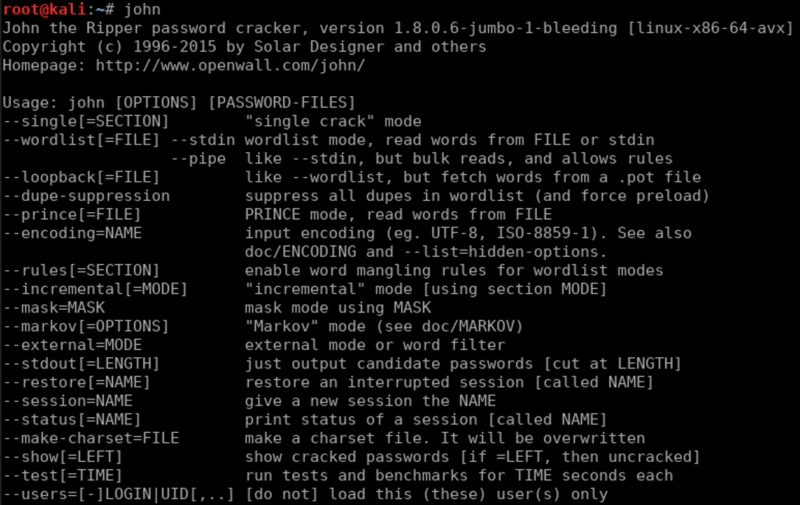

---

# Hi, I'm Chetan Verma

**Full-Stack Developer | AI Enthusiast | Linux & Security Explorer**

Hey i am chetan verma, Chief Technical Officer (CTO) of QuantSpace group, 1st-year ECE student passionate about building interactive web experiences, experimenting with AI, and exploring cybersecurity.  
I turn ideas into functional projects, from beautifully animated websites to intelligent AI-powered tools.

---

## Quick About Me

-  **ECE Student** (1st Year)  
-  **Full-Stack Developer** - React, Node.js, MongoDB  
-  **AI Builder** - Crafting intelligent applications  
-  **Linux & Cybersecurity** - CTF challenges, networking, security concepts  
-  **Currently Learning** - Data Structures & Algorithms (C++), Android Development  
-  **Goal** - Google Summer of Code (GSoC) 2026

##  Tech Stack

| Category | Technologies |
|----------|--------------|
| **Languages** |     |
| **Frontend** |     |
| **Backend** |    |
| **Databases** |    |
| **Tools & Platforms** |    |
| **Deployment** |    |
| **AI Tools** | ChatGPT, Claude, Gemini, GitHub Copilot |
| **Micro Controllers** | Arduino UNO, Raspberry Pi |
| **Security Tools** | Kali Linux, Burp Suite, Wireshark, Nmap, SQLmap, John The Ripper |

---

##  Featured Projects

###  Interactive Birthday Surprise Website
A heartfelt birthday experience with rich animations and interactive elements.  

-  Typing animations & image sliders  
-  Music player & dynamic compliments  
-  Custom UI effects
-  Interactive screens 

live preview [Coming Soon](#) | [Repository](#)

---

###  Rose Day Interactive Website
Romantic-themed web experience with smooth animations and elegant UI.  

-  Falling petals animation (coded)  
-  Interective flipbook with smooth animations  
-  Smooth transitions & custom effects
-  Media usage
-  Beautifully crafted and Designed screens  

live preview [Coming Soon](#) | [Repository](#)

---

###  Friendship Day Surprise Website
Celebrate friendships with engaging animations and interactive elements.  

-  Dynamic animations  
-  Interactive messaging  
-  Fully responsive design
-  Little inbuilt game
-  Music and Watermark  

live preview [Coming Soon](#) | [Repository](#)

---

###  AI Career Counselor
AI-powered career exploration tool with intelligent suggestions and guidance.  

-  ML-based recommendations  
-  Career path insights  
-  Skill analysis
-  AI assistent
-  Live-Data analytics  

live preview [Coming Soon](#) | [Repository](#)

---

###  DSA in C++ Journey
Mastering data structures and algorithms from fundamentals to advanced concepts.  

**Topics Covered:** Arrays, Strings, Stacks, Queues, Trees, Graphs, Sorting & Searching, Dynamic Programming  

[Explore Repo](#)

---

## QuantAI

An fully developed ai application with alot of USP's
Like;

- Offering Coustom Ai Chatbot Training Feature via Dataset.
- Voice Feautre trained through RVC, Inshort A Whole Virtual Soul Of Someone They Want Of!
- Ai + Social Media feature
- User Can Make and Add Friends in The AI Application
- Can Post Anything They Want
- All in One Place Ai, Switches Between API's as Per The Prompt
- Prepaid and Postpaid Api System
- Alot Of Other Cool Features

  ***Launching Soon***

##  Linux & Cybersecurity

Actively exploring security concepts and hands-on hacking with Kali Linux. 

Tools used to - John The Ripper, Zphisher, Nmap, Metasploit, Burp suite, Wireshark, Hashcat, SQLmap etc.

 

**Focus Areas:**  
-  CTF (Capture The Flag) challenges  
-  Networking fundamentals  
-  Linux command-line tools & scripting  
-  Security concepts & exploitation  
-  Penetration Testing

---

##  GitHub Stats & Analytics

### My GitHub Overview

### GitHub Streak Stats

### 📈 Contribution Activity

### A game? haha nope

### Additional Stats

---

##  2026 Goals

- ✅ Master Data Structures & Algorithms with C++  
- ✅ Build production-ready AI applications
- ✅ Build production-ready full-stack applications  
- ✅ Aim for Google Summer of Code (GSoC) 2026 
- ✅ Contribute meaningfully to open-source  
- ✅ Develop impactful projects with real-world impact  
- ✅ Diving deep into cybersecurity & ethical hacking

---

##  Connect With Me

---

**Always building, always learning, always improving.** 
